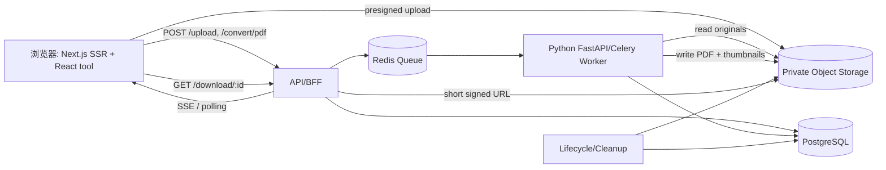

# img to PDF：竞品分析与可直接开发的产品方案

> 文档版本：v1.0 · 更新时间：2026-08-06  
> 目标站点：`imgtopdf`（暂定域名）  
> 核心关键词：`img to pdf`

## 0. 结论先行

Smallpdf 的 `/jpg-to-pdf` 页面不是“只有一个上传框”的工具页，而是把四件事做成了一个闭环：

1. 首屏立即满足转换意图：面包屑、明确的 H1、拖拽/选择文件入口。
2. 工具下面提供可被抓取的解释内容：支持格式、质量、隐私、跨设备、云端处理、步骤和 FAQ。
3. 页面把 JPG 需求扩展到 image/photo/JPEG/PNG/HEIC 等同义词和长尾场景。
4. 全站导航、相关工具和多语言入口形成强内链与主题权威，而不是孤立落地页。

因此新站的策略应是“工具优先 + 可验证的独特内容 + 可靠的文件体验 + 清晰的网站主题集群”，不是复制 Smallpdf 的视觉或文案。

本仓库目前只有本 README；它既是竞品分析报告，也是第一版 PRD、技术设计和开发拆分。

## 1. 研究范围与证据边界

已通过公开页面抓取核对 Smallpdf 页面正文：

- [Smallpdf JPG to PDF](https://smallpdf.com/jpg-to-pdf)
- [Smallpdf Image to PDF](https://smallpdf.com/image-pdf)

JPG 页面正文显示了导航、H1、上传入口、支持格式、功能卖点、步骤、FAQ、评分和 Footer。页面中可直接核对的关键信息包括：

- H1 为 **“Convert JPG to PDF for Free”**；
- 首屏文案强调“images and photos”“free, secure, fast”“no installation or account creation”；
- 功能文案覆盖拖拽、质量、边距、方向、尺寸、TLS、1 小时自动删除、跨操作系统、多图合并和云端处理；
- 步骤是上传/拖拽 → 调整尺寸、方向、边距 → Convert → 下载或分享；
- FAQ 覆盖格式、合并多图、质量、Mac/Windows、安全和免费额度；
- 页面显示评分 **4.5 / 5** 及投票数。

当前会话的浏览器插件没有返回可用浏览器实例，因此无法进行真实的鼠标点击、文件选择和下载验证。交互部分明确区分“页面文案/公开资料可证实”和“新站应实现的设计”，不会把推断写成 Smallpdf 的实测结果。页面 `<head>` 中的 canonical、JSON-LD 和 OG 原始标签也没有被正文抓取器暴露，故下文对它们标记为“未直接验证”，并给出新站上线时的确定实现。

## 2. 第一部分：竞品 SEO 分析

### 2.1 页面级 SEO 清单

| 项目 | Smallpdf 观察结果 | 对新站的结论 |
|---|---|---|
| Title | 搜索结果标题为 `JPG to PDF Converter: Convert Image & Photo to PDF for Free`。同时覆盖格式词、动作词、同义词和免费意图。 | 保留“动作 + 格式/对象 + 免费/在线”的信息密度；不要把品牌放在最前面挤掉关键词。建议 50–60 个英文字符左右并逐页唯一。 |
| Meta description | 抓取结果没有暴露原始 `<meta name="description">`，不能把搜索摘要当作精确标签。正文首段承诺“Turn images and photos into PDFs in seconds…free, secure, fast…no installation or account creation”。 | 新站必须在 SSR HTML 中写独立 description。推荐：`Convert JPG, PNG and other images to PDF online for free. Combine photos, reorder pages, adjust margins and download a high-quality PDF—no signup required.` |
| H1 | `Convert JPG to PDF for Free`。与页面 URL 和工具意图完全一致。 | `/jpg-to-pdf` 使用该 H1；首页使用 `Convert Images to PDF Online`，避免所有页面争抢一个 H1。 |
| URL | `/jpg-to-pdf`，短、可读、无参数。 | 使用小写、连字符和稳定 slug；工具状态、任务 ID、UTM 不进入可索引 URL。 |
| Canonical | 原始 head 未直接验证。 | 每个可索引落地页输出 self-canonical；`/jpeg-to-pdf` 等同义入口若无独特内容则 301 到 `/jpg-to-pdf`，不要用几十个重复 doorway 页。 |
| Schema | 正文可确认面包屑和 FAQ 内容，但 JSON-LD 类型未从当前抓取结果直接验证。 | 使用 `WebApplication`/`SoftwareApplication` + `BreadcrumbList`；FAQ JSON-LD 可用于语义理解，但不要以 FAQ 富结果为 KPI。Google 已将 FAQ 富结果限制到权威政府/健康站点，且 2026 年更新中移除了 FAQ 富结果文档。 |
| Open Graph | 原始 head 未直接验证。 | 明确设置 `og:type=website`、`og:title`、`og:description`、`og:url`、`og:image`、`og:site_name` 和 Twitter Card；分享图使用真实工具界面而不是纯 Logo。 |
| Robots/Sitemap | 页面正文未暴露。 | 工具落地页 `index,follow`；临时下载链接、任务页、错误页 `noindex`；提供 `sitemap.xml`、`robots.txt` 并在 Search Console 提交。 |

关于 title、description、canonical 的实现原则，Google 建议使用唯一、描述性标题/摘要，并在原始 HTML 中明确 canonical；见 [Google 开发者 SEO 指南](https://developers.google.com/search/docs/fundamentals/get-started-developers)、[canonical 指南](https://developers.google.com/search/docs/crawling-indexing/consolidate-duplicate-urls)。

### 2.2 关键词布局与搜索意图

| 关键词 | Smallpdf 页面覆盖情况 | 新站布局 |
|---|---|---|
| `img to pdf` | 页面正文更多使用 JPG/image/photo，而不是精确短语 `img to pdf`；这是一个可抢占的词形变体。 | 首页 Title、H1、首段和内部锚文本自然出现一次；不要在正文重复堆砌。 |
| `jpg to pdf` | Title、H1、首段、功能标题、步骤、FAQ、导航链接中多次出现，且与上传工具紧邻。 | `/jpg-to-pdf` 主词；首屏 100–150 词、一个功能 H2、步骤和 2–3 个 FAQ 覆盖。 |
| `image to pdf` | 通过 images/photos、其他图片格式、云端转换等语义覆盖；Smallpdf 另有 `/image-pdf` 页面承接宽词。 | `/image-to-pdf` 承接宽词；JPG/PNG/WebP 页面用清晰的 canonical 和互链分工。 |
| `convert image to pdf` | 通过“convert images/photos to PDFs”“How To Convert…”等动作型句式覆盖。 | 在首段、How-to H2、按钮辅助文本和 FAQ 中自然使用，重点满足任务而非写同义词清单。 |

可扩展的长尾意图：

- `jpg to pdf online/free/no signup`
- `combine multiple jpg images into one pdf`
- `convert png/webp/heic to pdf`
- `image to pdf with margins/orientation/page size`
- `jpg to pdf on Mac/Windows/iPhone/Android`
- `secure/private jpg to pdf`、`delete files after conversion`

Smallpdf 的内容布局顺序很有效：**工具 → 三条价值承诺 → 图文功能段 → 4 步 How-to → FAQ → 评分/站点导航**。它同时满足交易型意图（马上上传）和信息型意图（格式、安全、步骤），并把每个 FAQ 作为可独立匹配的自然语言问题。

### 2.3 为什么它具备排名优势（推断）

以下是基于页面证据和常见搜索系统信号的产品推断，不是 Smallpdf 内部排名数据：

1. **意图匹配快**：用户进入即看到上传框，不需要先读长文或注册。
2. **主题完整**：JPG、JPEG、image、photo、PNG、HEIC、GIF、BMP、TIFF、WebP、PDF 等词在一个清晰语义场里出现。
3. **可索引的独特正文**：六个 FAQ 与步骤描述处理了用户在转换前后的疑虑。
4. **信任信号**：TLS、自动删除、跨平台、无安装/免账号、用户数量和评分降低上传隐私顾虑。
5. **产品能力与内容一致**：文案说可调整页尺寸、方向、边距、预览和多图，工具体验应能兑现承诺。
6. **站点级内链**：Header/Footer 链接压缩、合并、PDF 转换、博客和行业方案，形成 PDF 主题集群。
7. **国际化与移动覆盖**：多语言入口和移动应用文案扩大了地区、设备和长尾覆盖。
8. **可分享性与品牌积累**：长期运行、内容更新、评分和外部链接是新站短期难以复制的部分，必须用更好的隐私、速度或离线能力建立差异。

## 3. 第二部分：页面结构分析

### 3.1 Smallpdf 页面模块

| 模块 | UI 作用 | 用户目的 | SEO 作用 | 新站是否保留 |
|---|---|---|---|---|
| Header | Logo、Tools 下拉、登录/试用、移动 App 入口 | 找其他工具或账户 | 建立站点主题、分发内链、增强品牌实体 | **保留，首屏简化**；移动端折叠菜单 |
| Breadcrumb + Hero | `Home > JPG to PDF`、H1 和一句承诺 | 确认自己进入了正确工具 | 语义层级、面包屑可视化、提高首屏相关性 | **保留** |
| 上传转换区域 | Choose Files、拖拽、格式提示 | 立即开始任务 | 交易意图最强；按钮/label 可被理解 | **核心保留并优先开发** |
| 价值承诺 | 免费、快速、安全、跨设备等 bullet | 判断是否值得上传私密文件 | 覆盖 online/free/secure/no signup 等修饰词 | **保留，改成真实 SLA** |
| 功能介绍 | 速度、质量、安全、格式、多图、云端等图文卡片 | 了解转换后能否满足要求 | 承接同义词与长尾问题，增加内容深度 | **保留 4–6 个原创模块** |
| 优势说明 | 隐私、兼容性、无安装、质量 | 消除风险和比较成本 | E-E-A-T/信任与转化辅助，不能只写空泛形容词 | **保留并给证据** |
| 使用步骤 | 4 步编号说明 | 不上传也能快速理解流程 | 覆盖 how-to 查询；文本必须在 DOM | **保留** |
| FAQ | 格式、合并、质量、平台、安全、免费 | 处理阻塞疑问 | 覆盖自然语言长尾；Schema 仅辅助理解，不保证富结果 | **保留** |
| 评分 | 4.5/5 与票数 | 社会证明 | 可能提高 CTR，但必须是真实、可审计数据 | **MVP 可后置** |
| 相关文章/相关工具 | 连接 image、PNG、WebP、压缩、PDF to Word 等 | 下一步工作 | 形成主题集群、传递内部链接权重 | **保留** |
| Footer | 产品、行业、公司、隐私、条款、语言 | 找政策和更多工具 | 爬虫发现重要 URL、实体/信任、国际化 | **保留，避免链接噪声** |

### 3.2 新站建议的页面线框

```text
[Logo] Tools  JPG to PDF  PNG to PDF  Compress PDF  [Language] [Theme]
---------------------------------------------------------------------
Breadcrumb: Home / Image tools / JPG to PDF
H1: Convert JPG to PDF Online for Free
一句话：批量上传、排序、调整布局，下载无水印 PDF。

┌───────────────────────────────────────────────────────────────────┐
│  Drop JPG/PNG/WebP here                                            │
│  [Choose images]   [Paste from clipboard]   [From device]          │
│  Supported formats · max size · privacy notice                     │
└───────────────────────────────────────────────────────────────────┘

[Upload state: thumbnails / reorder / rotate / delete / Add more]
[Page size A4/Letter/Auto] [Portrait/Landscape] [Margins] [Quality]
[Convert to PDF]

Why use img to PDF?  |  Privacy & auto-delete  |  Quality & compatibility
How to convert (1–4) | FAQ | Related tools/articles | Footer
```

首屏必须可用，但 SEO 文本不能依赖点击上传后才出现；所有解释性内容以语义 HTML SSR 输出。

## 4. 第三部分：交互流程与状态设计

### 4.1 实测限制与可复现测试脚本

本次环境没有浏览器实例，无法完成用户要求的真实点击链路。上线前应在 Chrome、Safari、Firefox、iOS Safari、Android Chrome 执行以下验收：

1. 选择一个 JPG，确认预览、尺寸和 EXIF 方向。
2. 一次选择 3 张，拖拽第 3 张到第 1 位，确认 PDF 页序一致。
3. 调整 A4、横向、边距和质量，确认预览/输出有对应变化。
4. 点击 Convert，观察上传/转换进度、按钮禁用、取消和刷新行为。
5. 下载 PDF，检查页数、尺寸、清晰度、文件名和 Content-Disposition。
6. 重新打开下载链接、过期链接、重复点击和网络断开场景。

Smallpdf 公开正文和相关使用说明可证实其产品承诺了预览、布局/尺寸/边距调整、多图组合和下载；以下状态机是新站的确定实现方案。

### 4.2 状态机

```text
idle
  └─ select/drop/paste ─> validating
       ├─ invalid ─> rejected (可逐项移除/重试)
       └─ valid ─> uploading
                      ├─ network error ─> upload-error (继续/重试)
                      └─ uploaded ─> editing
                                      ├─ reorder/rotate/delete/add
                                      └─ convert ─> converting
                                                     ├─ failed ─> convert-error
                                                     └─ done ─> completed ─> download
```

### 4.3 六步交互说明

| 步骤 | 前端逻辑 | 用户体验 |
|---|---|---|
| 1. 上传图片 | `<input type=file multiple accept>` + drag/drop；先在客户端读取 magic bytes、MIME、大小和像素，再分片上传。 | 拖拽区有 hover/focus 状态；显示每个文件的上传进度；支持继续添加。 |
| 2. 图片预览 | 生成 object URL 或服务端缩略图；读取 EXIF orientation；懒加载缩略图，原图不阻塞界面。 | 缩略图、文件名、尺寸、删除、旋转、放大；无障碍 label 和键盘操作。 |
| 3. 调整排序 | `@dnd-kit/sortable` 维护 `files[]` 顺序；键盘上下移动作为拖拽替代。 | 明确显示“第 1 页”；拖动时有占位符，触屏可用。 |
| 4. 参数设置 | 受控表单：`pageSize=auto|a4|letter|custom`、`orientation=auto|portrait|landscape`、`margin`、`quality`、`fit=contain|cover`。 | 设置即时回显；给出“原图比例/留白/文件大小”的解释。 |
| 5. 转换 | 提交 manifest + settings；服务端异步任务，前端用 SSE 优先、轮询兜底。 | 显示 `上传中/处理中/生成第 n 页`，锁定会改变输入的控件，保留取消按钮。 |
| 6. 下载 | 完成后返回短期 signed URL；记录一次下载；支持再次下载、复制链接（若启用）和继续转换。 | 主按钮变为“Download PDF”；文件名可编辑；说明过期时间和自动删除时间。 |

### 4.4 异常处理矩阵

| 场景 | 检测 | UI 文案/动作 |
|---|---|---|
| 格式错误 | MIME + magic bytes 双检 | “`xxx` 不是受支持的图片格式。支持 JPG、PNG、WebP、HEIC、GIF、BMP、TIFF。”保留其他合法文件。 |
| 文件过大 | 单文件/批次字节数和像素上限 | 在上传前显示限制；提供“压缩图片后重试”，不要上传后才静默失败。 |
| 文件损坏 | Pillow/libvips 解码失败 | 标记具体文件、允许移除后继续；不要让整个批次不可用。 |
| 网络断开 | fetch abort、超时、SSE close | 保留已完成文件；指数退避重试，给“重新连接/取消”。 |
| HEIC/特殊色彩 | 解码能力探测、CMYK/ICC 规范化 | 转换为 sRGB；若浏览器不能预览，显示通用缩略图并允许继续。 |
| EXIF 方向 | 读取 orientation 并在规范化阶段旋转 | 预览和 PDF 方向一致；提供手动旋转。 |
| 转换失败 | worker 返回结构化 error_code | “生成失败，文件未删除。重试或下载日志编号。”不暴露堆栈。 |
| 重复点击 | 前端锁定 + Idempotency-Key | 只生成一个任务，按钮显示处理中。 |
| 下载过期 | signed URL 403/过期 | “下载链接已过期，文件已自动清理。重新上传即可。” |
| 浏览器内存不足 | 大图解码/缩略图监控 | 降低预览分辨率、分批处理；提示关闭其他标签页或使用桌面端。 |

## 5. 第四部分：技术实现方案

### 5.1 推荐技术栈

| 层 | 选择 | 原因 |
|---|---|---|
| Web/SEO | Next.js 15+、React、TypeScript、App Router | 服务端输出 title/H1/正文/JSON-LD；页面可 SSG/ISR，工具组件再 hydration。 |
| UI | Tailwind CSS + 设计 token，Radix/shadcn 任选 | 快速响应式开发、可访问组件、避免复制竞品视觉。 |
| 上传/排序 | 原生 File API + `@dnd-kit` | 多文件、触屏、键盘排序；不绑定重量级上传 SaaS。 |
| API/BFF | Next.js Route Handler 或 NestJS | 统一鉴权、限流、signed URL 和任务状态；MVP 可先用 Route Handler。 |
| 转换 worker | Python FastAPI + Celery/RQ | 图像格式生态完整，CPU 任务可横向扩容。 |
| 队列 | Redis + Celery（或 SQS） | 解耦 API 与转换、重试、进度。 |
| 数据库 | PostgreSQL | 任务、文件、用户、配额和审计字段结构稳定。 |
| 文件存储 | S3 兼容对象存储（S3/R2/MinIO） | 分片上传、生命周期删除、signed URL。 |
| 观测 | OpenTelemetry + Sentry + Prometheus | 追踪上传成功率、p95 转换耗时和 worker 失败原因。 |

### 5.2 前端页面与组件

```text
app/
  (marketing)/page.tsx                 # 首页 / img to pdf
  (tools)/[tool]/page.tsx              # jpg-to-pdf 等 SEO 落地页
  (tools)/[tool]/loading.tsx
  (tools)/[tool]/error.tsx
  api/upload/route.ts                  # 可选 BFF
  api/convert/pdf/route.ts
  api/tasks/[id]/route.ts
  api/download/[id]/route.ts
  sitemap.ts
  robots.ts
components/
  uploader/FileDropzone.tsx
  uploader/FileQueue.tsx
  uploader/FileItem.tsx
  preview/ImagePreview.tsx
  preview/PreviewToolbar.tsx
  editor/SortableImageList.tsx
  editor/PdfSettingsForm.tsx
  progress/ConversionProgress.tsx
  download/DownloadCard.tsx
  seo/Breadcrumbs.tsx
  seo/JsonLd.tsx
  content/FeatureGrid.tsx
  content/HowTo.tsx
  content/Faq.tsx
hooks/
  useFileValidation.ts
  useUploadQueue.ts
  useSortableFiles.ts
  useConversionJob.ts
  useDownload.ts
utils/
  file-signature.ts
  image-metadata.ts
  format-bytes.ts
  api-client.ts
  seo-metadata.ts
  errors.ts
```

### 5.3 后端文件处理流程

```text
客户端选择/拖拽图片
        ↓
前端快速校验（数量、扩展名、字节数、像素）
        ↓
POST /upload（分片或 presigned PUT）
        ↓
服务端校验 magic bytes + 病毒扫描 + EXIF/尺寸读取
        ↓
对象存储 original（私有 bucket，短生命周期）
        ↓
POST /convert/pdf（创建 conversion_task）
        ↓
队列 → worker 解码/规范化 sRGB/压缩 → PDF 生成
        ↓
对象存储 converted + checksum + 页数/大小
        ↓
返回任务状态和短期下载地址
        ↓
GET /download/{id} → signed URL/流式下载
        ↓
生命周期任务在 1–24 小时内删除输入、输出和缩略图
```

### 5.4 API 设计

#### `POST /upload`

推荐用 presigned multipart 以减少 API 服务器带宽；下面的接口是业务层创建文件记录的统一入口。

请求：

```json
{
  "files": [
    {
      "name": "receipt-01.jpg",
      "size": 1834200,
      "mime": "image/jpeg",
      "sha256": "optional-client-hash"
    }
  ],
  "sessionId": "anonymous-session-id"
}
```

响应 `201`：

```json
{
  "uploadId": "upl_01J...",
  "files": [
    {
      "fileId": "fil_01J...",
      "uploadUrl": "https://storage.example/...",
      "expiresAt": "2026-08-06T10:10:00Z"
    }
  ],
  "limits": { "maxFiles": 20, "maxFileBytes": 25000000, "maxBatchBytes": 100000000 }
}
```

#### `POST /convert/pdf`

请求：

```json
{
  "fileIds": ["fil_01J...", "fil_01K..."],
  "settings": {
    "pageSize": "a4",
    "orientation": "auto",
    "margin": "small",
    "quality": "balanced",
    "fit": "contain",
    "outputName": "images-to-pdf.pdf"
  },
  "idempotencyKey": "client-generated-uuid"
}
```

响应 `202`：

```json
{
  "taskId": "task_01J...",
  "status": "queued",
  "pollUrl": "/api/tasks/task_01J...",
  "eventsUrl": "/api/tasks/task_01J.../events"
}
```

#### `GET /tasks/{id}`

```json
{
  "taskId": "task_01J...",
  "status": "processing",
  "progress": 62,
  "currentStep": "rendering_page",
  "currentFile": 2,
  "totalFiles": 4,
  "error": null
}
```

状态值：`queued | uploading | validating | processing | completed | failed | expired | cancelled`。

#### `GET /download/{id}`

- 校验任务归属、状态和未过期时间。
- 方式 A：`302` 到 10–30 分钟有效的对象存储 signed URL。
- 方式 B：API 代理流式返回，并设置 `Content-Type: application/pdf`、`Content-Disposition: attachment`、`X-Content-Type-Options: nosniff`。

统一错误格式：

```json
{
  "error": {
    "code": "FILE_TOO_LARGE",
    "message": "One file exceeds the 25 MB limit.",
    "retryable": false,
    "requestId": "req_01J..."
  }
}
```

### 5.5 安全、隐私与成本控制

- 文件类型同时检查扩展名、声明 MIME 和文件 magic bytes，禁止 SVG 脚本、宏和不支持的容器格式。
- 文件名只保留安全 Unicode 子集，存储键使用随机 UUID，日志不写原文件名或图片内容。
- 对象存储默认私有、服务端加密、生命周期自动删除；下载使用短期签名 URL。
- 上传和转换接口按 IP、匿名 session、账户和设备指纹限流；设置每日免费额度，避免被当作开放代理。
- 图片解码置于隔离 worker/容器，限制 CPU、内存、像素总数和处理时长，防止 decompression bomb。
- HTTPS/TLS、CORS 白名单、CSRF（如使用 cookie）、依赖漏洞扫描、恶意文件扫描和审计日志。
- 隐私页明确“是否上传、保存多久、何时删除、是否用于训练”；不要只复制竞品的“一小时”承诺。

## 6. 第五部分：图片转 PDF 技术方案比较

### 6.1 Node.js

典型组合：`sharp` 做解码/缩放/色彩规范化，`pdf-lib` 或 `PDFKit` 生成 PDF，HEIC 使用额外原生依赖。

| 维度 | 评价 |
|---|---|
| 优点 | 与 Next.js/TypeScript 统一语言；部署简单；I/O 和队列生态成熟；小文件同步转换体验好。 |
| 缺点 | 大图和多页任务容易占用 Node heap；CMYK、ICC、EXIF、HEIC/TIFF 的边界行为依赖原生库；PDF 高级特性需自行验证。 |
| 性能 | 单个中等 JPG 很快；CPU 密集批量任务应使用 worker_threads/独立进程和内存上限。 |
| 适合 | 纯 Web/TypeScript 团队、MVP、格式范围有限、希望少维护一种语言。 |

### 6.2 Java

典型组合：Apache PDFBox + TwelveMonkeys ImageIO；商用 PDF 需求可评估 iText（注意许可证）。

| 维度 | 评价 |
|---|---|
| 优点 | 长期运行稳定、线程模型和内存边界可控；企业级监控、审计和批处理成熟；PDFBox 对页面/元数据控制好。 |
| 缺点 | 服务体积和启动时间较大；图像格式适配代码较多；iText 商业许可需提前确认。 |
| 性能 | 多核批量任务表现好，适合高并发后台 worker；冷启动不如轻量函数。 |
| 适合 | 已有 JVM 平台、企业内网、强审计/批量归档。 |

### 6.3 Python

典型组合：Pillow（可选 `pillow-heif`）或 libvips 做图像规范化，`img2pdf` 保持 JPEG 无损嵌入，PyMuPDF/PDFBox 类库做页面和元数据。

| 维度 | 评价 |
|---|---|
| 优点 | 图像格式和 EXIF 生态最完整；开发快；`img2pdf` 对 JPEG/PNG 到 PDF 的路径直接；适合独立 CPU worker。 |
| 缺点 | CPython 线程不适合 CPU 密集并行，需要多进程/队列；原生依赖镜像要固定版本；超大批次需严格资源隔离。 |
| 性能 | 通过 Celery 多进程、预缩略图和 JPEG 直嵌入可达到稳定吞吐；单任务延迟可预测。 |
| 适合 | 需要 JPG/PNG/WebP/HEIC/TIFF、多页、EXIF、质量策略，且愿意把转换从 Web 进程隔离的产品。 |

### 6.4 最终推荐

采用 **Next.js/TypeScript Web + Python FastAPI/Celery 转换 worker + PostgreSQL + S3/R2 + Redis**：

- Web 层负责 SEO、上传编排、实时进度和下载，不承担大图 CPU 任务。
- Python worker 负责解码、EXIF 方向、sRGB/质量策略和 PDF 生成，便于扩展 HEIC、OCR 和压缩。
- 所有 worker 任务可横向扩展，失败可重试，输入/输出由对象存储生命周期自动清理。

如果团队只有 TypeScript 且首版只支持 JPG/PNG，可先用 `sharp + pdf-lib` 做 Node worker，并保留队列和接口边界，后续替换转换实现而不改前端。

## 7. 第六部分：SEO 网站架构

### 7.1 URL 树

```text
/
├── jpg-to-pdf
├── png-to-pdf
├── webp-to-pdf
├── image-to-pdf
├── compress-pdf
├── pdf-to-word
├── jpeg-to-pdf                 # 同义入口：301 到 /jpg-to-pdf，除非有独特意图
├── heic-to-pdf                 # 有真实 HEIC 处理能力后上线
├── gif-to-pdf
├── bmp-to-pdf
├── tiff-to-pdf
├── merge-jpg-to-pdf            # 多图合并意图，内容必须与单图页不同
├── blog/
│   ├── how-to-convert-image-to-pdf
│   ├── jpg-vs-pdf
│   └── convert-photo-to-pdf-on-iphone
├── privacy
├── terms
└── status
```

### 7.2 页面与关键词分工

| 页面 | 主关键词 | 独特内容角度 |
|---|---|---|
| `/` | img to pdf、image converter | 宽意图、格式入口、隐私承诺、工具总览 |
| `/jpg-to-pdf` | jpg to pdf、jpg to pdf online/free | JPG/JPEG、多图排序、A4/Letter、质量 |
| `/png-to-pdf` | png to pdf | 透明背景、无损、页面填充策略 |
| `/webp-to-pdf` | webp to pdf | 浏览器图片、WebP 解码与兼容性 |
| `/image-to-pdf` | image to pdf、convert image to pdf | 多格式统一入口、照片/扫描件场景 |
| `/compress-pdf` | compress pdf | 输出大小、质量档位、上传限制 |
| `/pdf-to-word` | pdf to word | 文本层/OCR、编辑工作流；必须是实际能力 |
| `/merge-jpg-to-pdf` | merge jpg to pdf、combine images into pdf | 批量合并、页序、删除/旋转页面 |

不要为了关键词把同一段复制到 JPG、JPEG、Image、Photo、Picture 多个 URL。每个可索引页面至少应有独特的首段、工具默认设置、示例、FAQ 和内部链接；没有独特价值的同义词 URL 做 301/canonical。

### 7.3 每个 SEO 工具页的固定模板

1. SSR `<title>`、description、canonical、OG/Twitter。
2. Breadcrumb + 唯一 H1 + 40–80 字首段，首段同时说明输入、输出和核心限制。
3. 首屏上传/拖拽工具（无需登录即可试用）。
4. 支持格式、隐私、质量、设备兼容性四条可信承诺。
5. 4–6 个真正独特的功能卡片，使用真实截图/示例和 alt 文本。
6. How-to 四步，文本在 DOM，工具交互不阻塞索引。
7. FAQ 6–8 个高意图问题，答案先给结论再给限制。
8. 相关工具和文章，锚文本描述目标页面。
9. Footer、隐私、条款、状态页和联系方式。

Google 建议重要文本使用语义 HTML、提供唯一标题/摘要和清晰内链；见 [SEO developer guide](https://developers.google.com/search/docs/fundamentals/get-started-developers) 和 [sitelinks/内链建议](https://developers.google.com/search/docs/appearance/sitelinks)。FAQ 内容仍然值得保留以服务用户和覆盖长尾，但截至 2026 年不应把 FAQ 富结果展示当作增长假设；参见 [Google FAQ/How-to 变化说明](https://developers.google.com/search/blog/2023/08/howto-faq-changes)。

### 7.4 技术 SEO 验收

- 重要页面首个 HTML 响应即包含 title、description、canonical、H1、正文和 JSON-LD，不依赖客户端 API 才出现。
- Core Web Vitals：LCP < 2.5s、INP < 200ms、CLS < 0.1（以真实用户数据持续监测）。
- 图片使用 AVIF/WebP、明确宽高、懒加载非首屏图片、提供 descriptive alt。
- `sitemap.xml` 只提交 canonical 200 页面；任务/下载 URL 不入 sitemap。
- `hreflang` 只在有人工维护翻译时启用；语言 URL 互相返回正确 alternate。
- JSON-LD 用 Rich Results Test/Schema Validator 检查，且字段与页面可见内容一致；Google 不保证正确结构化数据一定显示富结果。
- 使用 Search Console 监控索引、查询、转化率、页面体验和抓取错误。

## 8. 第七部分：数据库设计

匿名使用不强制创建 user；`user_id` 可为空，使用短期 `anonymous_session_hash` 做配额和风控。PostgreSQL 逻辑模型如下：

### 8.1 `user`

| 字段 | 类型 | 说明 |
|---|---|---|
| `id` | UUID PK | 用户 ID |
| `email` | citext nullable | 登录邮箱，唯一 |
| `plan` | varchar | `anonymous/free/pro` |
| `status` | varchar | `active/blocked/deleted` |
| `created_time` | timestamptz | 创建时间 |
| `updated_time` | timestamptz | 更新时间 |

### 8.2 `conversion_task`

| 字段 | 类型 | 说明 |
|---|---|---|
| `id` | UUID PK | 任务 ID |
| `user_id` | UUID FK nullable | 允许匿名 |
| `anonymous_session_hash` | varchar | 脱敏配额键 |
| `tool_slug` | varchar | `jpg-to-pdf` 等 |
| `status` | varchar | `queued/uploading/processing/completed/failed/expired/cancelled` |
| `settings` | jsonb | page size、方向、边距、质量、fit |
| `input_count` | int | 输入文件数 |
| `output_file_id` | UUID nullable | 生成的 PDF |
| `progress` | smallint | 0–100 |
| `error_code` | varchar nullable | 稳定错误码 |
| `idempotency_key` | varchar | `(user/session, key)` 唯一 |
| `created_time` | timestamptz | 创建时间 |
| `started_time` | timestamptz nullable | 开始处理 |
| `completed_time` | timestamptz nullable | 完成时间 |
| `expires_at` | timestamptz | 下载/数据过期时间 |

索引：`(status, created_time)`、`(user_id, created_time desc)`、`(anonymous_session_hash, created_time desc)`、唯一 `idempotency_key`。

### 8.3 `file_record`

| 字段 | 类型 | 说明 |
|---|---|---|
| `id` | UUID PK | 文件 ID |
| `task_id` | UUID FK | 所属任务 |
| `role` | varchar | `original/thumbnail/converted` |
| `original_file` | varchar | 原文件名（加密或脱敏存储） |
| `storage_key` | varchar unique | 对象存储键 |
| `converted_file` | varchar nullable | 输出文件名 |
| `mime` | varchar | 校验后的 MIME |
| `bytes` | bigint | 字节数 |
| `sha256` | char(64) | 去重/完整性 |
| `width` / `height` | int nullable | 图片像素 |
| `page_count` | int nullable | PDF 页数 |
| `status` | varchar | `pending/ready/deleted/quarantined` |
| `created_time` | timestamptz | 创建时间 |
| `deleted_time` | timestamptz nullable | 清理时间 |

### 8.4 可选表

- `usage_event`：上传、开始转换、完成、下载、失败，用于漏斗和计费。
- `rate_limit_bucket`：Redis 为主，数据库留审计摘要。
- `api_key`：未来开放 API 时使用，密钥只存 hash。

## 9. 第八部分：PRD

### 9.1 产品目标

在不注册的情况下，让用户在 60 秒内把 1–20 张 JPG/PNG/WebP 图片合成一个可下载 PDF，并在 Google 上覆盖 `img to pdf`、`jpg to pdf`、`image to pdf` 和 `convert image to pdf`。

### 9.2 用户与场景

- 学生：把作业/照片合成一个 PDF。
- 办公用户：把收据、发票、扫描页合并并调整 A4/Letter。
- 移动端用户：从手机照片快速生成可上传文件。
- 开发者/批量用户：需要稳定 API（后续版本）。

### 9.3 MVP 范围

**必须有**

- JPG/JPEG、PNG、WebP 输入；多文件上传；拖拽排序。
- 缩略图预览、删除、旋转；A4/Letter/Auto、方向、边距、质量。
- 服务端异步转换、进度、失败重试、下载和自动过期删除。
- 首页、JPG、PNG、WebP、Image SEO 落地页；SSR meta/正文/JSON-LD。
- 隐私、条款、状态页；匿名限流和基础观测。

**第二阶段**

- HEIC/GIF/BMP/TIFF；图片裁剪/填充；云盘导入导出。
- OCR、PDF 压缩、PDF to Word；账户历史和批量下载。
- 多语言、博客内容集群、API key 和付费配额。

**明确不做**

- 没有真实转换能力时上线“支持所有格式”的薄页面。
- 伪造评分、用户数量、安全认证或“零质量损失”承诺。
- 为每一个同义词建立重复 doorway 页面。

### 9.4 关键验收标准

1. 合法的 1 张 JPG 从点击上传到下载成功率 ≥ 99%（排除用户主动取消）。
2. 10 张、每张 5 MB 的 JPG 在基准 worker 上 p95 完成时间 ≤ 10 秒（按部署规格压测后定最终 SLA）。
3. 生成 PDF 页数、顺序、方向、尺寸和边距与设置一致。
4. 任一文件校验失败不影响同批次其他合法文件继续编辑。
5. 任务/下载 URL 不被搜索引擎索引，过期对象在生命周期窗口内删除。
6. 键盘可完成上传、排序、参数设置、转换和下载；移动端触屏可用。
7. Lighthouse 移动端性能/可访问性/SEO 基线 ≥ 90（以真实业务内容为准）。

### 9.5 产品指标

- `upload_start → upload_success`
- `upload_success → convert_start`
- `convert_start → convert_success`
- `convert_success → download_click`
- 失败率按 `error_code`、浏览器、格式、文件大小分桶
- p50/p95 上传和转换耗时、worker CPU/内存、对象存储成本
- Search Console 展现、点击、CTR、平均位置和索引覆盖
- Core Web Vitals、无障碍错误、隐私删除任务成功率

## 10. 前后端架构与数据流图



任务状态的写入以数据库为准，Redis 只负责队列和短期进度广播；SSE 断线时前端自动回退到 `GET /tasks/{id}` 轮询。

## 11. 项目目录结构（可直接创建）

```text
imgtopdf/
├── apps/
│   ├── web/                         # Next.js App Router
│   │   ├── app/
│   │   │   ├── (marketing)/page.tsx
│   │   │   ├── (tools)/[tool]/page.tsx
│   │   │   ├── api/upload/route.ts
│   │   │   ├── api/convert/pdf/route.ts
│   │   │   ├── api/tasks/[id]/route.ts
│   │   │   ├── api/download/[id]/route.ts
│   │   │   ├── sitemap.ts
│   │   │   └── robots.ts
│   │   ├── components/
│   │   ├── hooks/
│   │   ├── lib/
│   │   └── tests/
│   └── api/                         # 可选：NestJS 独立 API
├── services/
│   └── converter/
│       ├── app/main.py
│       ├── app/tasks.py
│       ├── app/image_normalizer.py
│       ├── app/pdf_renderer.py
│       ├── app/storage.py
│       ├── tests/
│       └── Dockerfile
├── packages/
│   ├── contracts/                   # OpenAPI/JSON Schema 共享类型
│   ├── seo-content/                 # 页面 metadata、FAQ、内链配置
│   └── ui/
├── infra/
│   ├── docker-compose.yml
│   ├── terraform/
│   └── migrations/
├── docs/
│   ├── api.md
│   ├── seo.md
│   └── runbook.md
├── .env.example
├── package.json
└── README.md
```

## 12. 开发任务拆分

### Sprint 0：基线与验证（1–2 天）

- 确认域名、品牌、默认语言、免费额度、最大文件/像素、数据保留时长。
- 建立 Next.js monorepo、CI、lint、测试、Docker Compose（Postgres/Redis/MinIO）。
- 用真实图片建立基准集：JPG、PNG、透明 PNG、EXIF 旋转、CMYK、超大图、损坏文件。

### Sprint 1：SEO 壳与上传（3–5 天）

- Header、Footer、Breadcrumb、metadata、canonical、OG、sitemap、robots。
- FileDropzone、逐项校验、缩略图、删除、旋转、拖拽/键盘排序。
- `/`、`/jpg-to-pdf`、`/png-to-pdf`、`/webp-to-pdf`、`/image-to-pdf` 页面模板和原创内容。

### Sprint 2：后端与转换（4–7 天）

- `POST /upload`、presigned multipart、文件记录和对象存储。
- `POST /convert/pdf`、任务状态、Redis 队列、Python worker。
- PDF 页面尺寸/方向/边距/质量；signed download；生命周期删除。

### Sprint 3：体验与可靠性（3–5 天）

- SSE + polling fallback、进度、取消、重试、错误码、幂等。
- 移动端、无障碍、离线断网提示、大批次内存保护。
- Sentry/OpenTelemetry、限流、恶意文件扫描、隐私/条款/状态页。

### Sprint 4：内容增长与上线（持续）

- `/compress-pdf`、`/pdf-to-word`、`/merge-jpg-to-pdf`（能力完成后）。
- 博客/指南、内链、外链数字公关、Search Console、A/B 测试首屏文案。
- 每周检查索引、CWV、转换漏斗、失败 code、存储清理和成本。

### Definition of Done

- 功能测试、API 契约测试、worker 基准和端到端下载测试通过。
- Chrome/Safari/Firefox + iOS/Android 核心链路通过。
- Lighthouse、axe、OWASP 依赖扫描和隐私删除任务通过。
- 生产环境 smoke test：上传、转换、下载、过期、失败重试、限流。
- SEO 页面通过 HTML 源码检查、Rich Results Test、canonical/语言/站点地图检查。

## 13. 上线前检查清单

### 产品

- [ ] 单图和多图都能完成；页序、方向、边距、质量正确。
- [ ] 错误提示针对具体文件，支持继续和重试。
- [ ] 下载名、过期时间、隐私说明清楚可见。

### SEO

- [ ] `img to pdf` 在首页和核心页面自然出现，`jpg to pdf` 在 JPG 页占主位。
- [ ] 每个页面 title、description、H1、canonical、OG、正文独特。
- [ ] 没有重复同义词 doorway；无能力页面不索引。
- [ ] SSR HTML 可见，内链锚文本准确；sitemap/robots 正确。
- [ ] FAQ 内容真实可见，Schema 与可见内容一致，不承诺 FAQ 富结果。

### 工程与安全

- [ ] 对象存储私有、signed URL 短期、自动清理作业可观测。
- [ ] magic bytes、像素上限、超时、内存、限流和病毒扫描生效。
- [ ] 关键指标、日志脱敏、告警和回滚 Runbook 完成。

## 14. 参考页面

- [Smallpdf JPG to PDF Converter](https://smallpdf.com/jpg-to-pdf)
- [Smallpdf Image to PDF Converter](https://smallpdf.com/image-pdf)
- [Smallpdf：How To Change JPG to PDF](https://smallpdf.com/blog/how-to-change-jpg-to-pdf)
- [Smallpdf：Merge JPG Files Into One Online](https://smallpdf.com/blog/merge-jpg)
- [Google：SEO guide for developers](https://developers.google.com/search/docs/fundamentals/get-started-developers)
- [Google：canonical consolidation](https://developers.google.com/search/docs/crawling-indexing/consolidate-duplicate-urls)
- [Google：structured data general guidelines](https://developers.google.com/search/docs/appearance/structured-data/sd-policies)

## 15. 当前前端实现状态（2026-08-06）

已按 `imgtopdf.org` 作为 canonical 域名完成第一版无数据库前端：

- `/`：聚合首页，主关键词 `img to pdf`，含首屏工具、免费/免登录卖点、工具分组、四步教程、FAQ 和相关内链。
- `/`：主 `img to pdf` SEO 页面；`/image-to-pdf`：详细 `image to pdf` 工具页。旧 `/img-to-pdf` 路由已删除，不再生成第二个关键词页面。
- `/img-to-word`、`/pdf-to-img`、`/jpg-to-pdf`、`/png-to-pdf`、`/webp-to-pdf`、`/pdf-to-word`、`/compress-pdf`：复用同一工具页模板，拥有独立标题、描述、FAQ、参数文案和相关推荐。
- `/privacy`、`/terms`：说明当前浏览器端处理范围和使用限制，生产 Worker 上线后需同步更新正式政策。
- `public/og.png`：与站点视觉方向一致的社交分享卡，并已接入 Open Graph/Twitter metadata。
- `app/sitemap.ts`、`app/robots.ts`：只提交公开 SEO 页面，屏蔽 `/api/` 和 `/download/`。
- 工具内页增加 HowTo + FAQPage JSON-LD，且结构化数据对应页面上可见的教程和 FAQ 内容。

当前上传区支持拖拽/选择、多文件预览、排序、移除、文件大小校验、基础设置和转换进度。图片类工具会在浏览器端生成实际可打开的 PDF，并在成功后自动下载；图片转 Word 会下载真实 DOCX，保留原图视觉层并叠加中文/英文 OCR 可编辑文本控件，检测到表格表单时自动添加“点击填写”字段（首次 OCR 需要联网加载识别引擎）；PDF 转图片会用 PDF.js 渲染页面并在多页时打包 ZIP；PDF 转 Word 会提取可选择文本；Compress PDF 会用 pdf-lib 重写 PDF 结构和元数据。扫描 PDF 的 OCR、复杂版面还原和深度图片重采样仍属于后续增强能力。所有结果均提供“Download file”和“Download again”兜底按钮。

本地运行：

```bash
npm install
npm run dev
```

验证命令：

```bash
npm test
npm run lint
```
